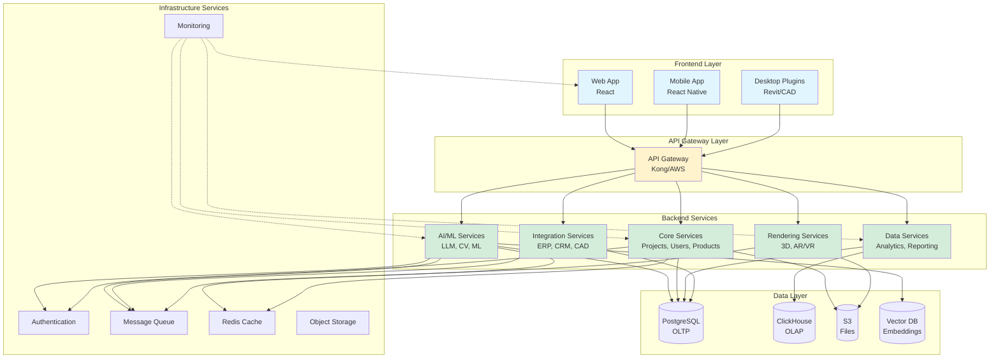
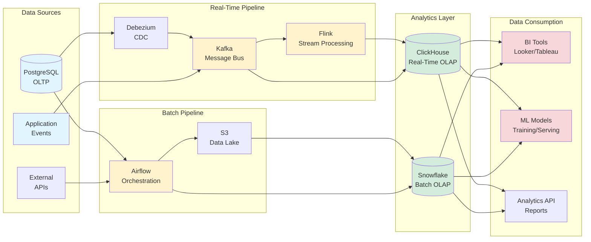
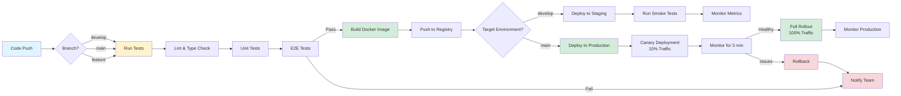

# OFS AI Platform: Technical Architecture

**Version:** 1.0
**Date:** October 14, 2025
**Author:** Engineering Architecture Team
**Status:** Design Document

---

## Table of Contents

1. [Architecture Overview](#architecture-overview)
2. [System Components](#system-components)
3. [Technology Stack](#technology-stack)
4. [Data Architecture](#data-architecture)
5. [AI/ML Infrastructure](#aiml-infrastructure)
6. [Security Architecture](#security-architecture)
7. [Scalability & Performance](#scalability--performance)
8. [Deployment Strategy](#deployment-strategy)
9. [Monitoring & Observability](#monitoring--observability)
10. [Disaster Recovery](#disaster-recovery)

---

## Architecture Overview

### High-Level System Architecture

```
┌───────────────────────────────────────────────────────────────────────┐
│                         CLIENT LAYER                                   │
├───────────────────────────────────────────────────────────────────────┤
│                                                                        │
│  ┌──────────────┐  ┌──────────────┐  ┌──────────────┐               │
│  │   Web App    │  │  Mobile App  │  │  Desktop     │               │
│  │   (React)    │  │  (RN/Native) │  │  Plugins     │               │
│  │              │  │              │  │  (Revit/CAD) │               │
│  └──────────────┘  └──────────────┘  └──────────────┘               │
│         │                  │                  │                       │
└─────────┼──────────────────┼──────────────────┼───────────────────────┘
          │                  │                  │
          └──────────────────┴──────────────────┘
                             │
┌────────────────────────────┴──────────────────────────────────────────┐
│                       CDN / EDGE LAYER                                 │
│                  (CloudFront / Cloudflare)                             │
│                                                                        │
│  - Static Assets (JS, CSS, Images)                                    │
│  - 3D Models (GLTF/GLB files)                                         │
│  - Cached API Responses                                               │
│  - DDoS Protection                                                     │
└────────────────────────────┬──────────────────────────────────────────┘
                             │
┌────────────────────────────┴──────────────────────────────────────────┐
│                       API GATEWAY LAYER                                │
│            (AWS API Gateway / Kong / Azure APIM)                       │
│                                                                        │
│  - Authentication & Authorization                                      │
│  - Rate Limiting & Throttling                                         │
│  - Request Routing                                                     │
│  - API Versioning                                                      │
│  - Request/Response Transformation                                     │
└────────────┬───────────────┬──────────────┬────────────────┬──────────┘
             │               │              │                │
    ┌────────┴────┐  ┌───────┴───────┐  ┌─┴──────────┐  ┌──┴────────┐
    │             │  │               │  │            │  │           │
┌───▼───────┐ ┌──▼────────┐ ┌───────▼──┐ ┌▼──────────┐ ┌▼──────────┐
│           │ │           │ │          │ │           │ │           │
│    AI     │ │   Core    │ │  Data    │ │Integration│ │ Rendering │
│ Services  │ │ Services  │ │ Services │ │ Services  │ │ Services  │
│           │ │           │ │          │ │           │ │           │
└───────────┘ └───────────┘ └──────────┘ └───────────┘ └───────────┘
```

---

### Service-Oriented Architecture

The platform follows a **microservices architecture** with clear separation of concerns:



**Frontend Services:**
- Web application (SPA)
- Mobile applications (iOS, Android)
- Desktop plugins (Revit, SketchUp, AutoCAD)

**Backend Services:**
- AI/ML services (LLM orchestration, computer vision, recommendations)
- Core business services (projects, users, products, pricing)
- Data services (analytics, reporting, insights)
- Integration services (ERP, CRM, CAD tools)
- Rendering services (3D, photorealistic, AR/VR)

**Infrastructure Services:**
- Authentication & Authorization
- API Gateway
- Message Queue
- Cache
- Storage
- Monitoring

---

## System Components

### 1. Web Application

**Technology:** React 18 + TypeScript

**Architecture:** Single Page Application (SPA)

**Key Libraries:**
```json
{
  "react": "^18.2.0",
  "typescript": "^5.0.0",
  "zustand": "^4.5.0",          // State management
  "@tanstack/react-query": "^5.0.0",  // Server state
  "react-router-dom": "^6.20.0",
  "@shadcn/ui": "latest",        // UI components
  "tailwindcss": "^3.4.0",
  "three": "^0.160.0",           // 3D rendering
  "@react-three/fiber": "^8.15.0",
  "vite": "^5.0.0"               // Build tool
}
```

**State Management:**
- **Local UI State:** React useState, useReducer
- **Global State:** Zustand (lightweight, no boilerplate)
- **Server State:** TanStack Query (caching, refetching)
- **Form State:** React Hook Form + Zod validation

**Routing:**
```typescript
// App.tsx
const router = createBrowserRouter([
  {
    path: "/",
    element: <Layout />,
    children: [
      { index: true, element: <Dashboard /> },
      { path: "projects", element: <ProjectList /> },
      { path: "projects/:id", element: <ProjectDetail /> },
      { path: "projects/:id/edit", element: <ProjectEditor /> },
      { path: "estimate/new", element: <EstimateWizard /> },
      { path: "products", element: <ProductCatalog /> },
      { path: "analytics", element: <Analytics /> },
    ]
  },
  { path: "/auth/login", element: <Login /> },
  { path: "/auth/signup", element: <Signup /> },
]);
```

**Performance Optimizations:**
- Code splitting with React.lazy()
- Image optimization with next-gen formats (WebP, AVIF)
- Virtual scrolling for large lists (react-window)
- Debounced search and inputs
- Service Worker for offline capability

---

### 2. Mobile Application

**Technology:** React Native (cross-platform iOS/Android)

**Alternative:** Native Swift (iOS) + Kotlin (Android) for performance-critical features

**Key Features:**
- AR visualization (ARKit, ARCore)
- Voice input (device native speech recognition)
- Camera integration (floor plan scanning)
- Offline mode (SQLite local database)
- Push notifications

**Architecture:**
```
src/
├── screens/          # Screen components
├── components/       # Reusable UI components
├── navigation/       # React Navigation config
├── services/         # API clients, auth
├── store/           # State management
├── utils/           # Helpers
└── native/          # Native module bridges
```

---

### 3. API Gateway

**Technology:** Kong or AWS API Gateway

**Responsibilities:**
- **Authentication:** JWT validation, OAuth 2.0
- **Authorization:** RBAC enforcement
- **Rate Limiting:** Per-user, per-endpoint limits
- **Request Routing:** Service discovery and load balancing
- **Transformation:** Request/response format conversion
- **Caching:** Response caching with TTL
- **Analytics:** Request logging and metrics

**Example Kong Configuration:**
```yaml
services:
  - name: ai-service
    url: http://ai-service:8000
    routes:
      - name: ai-chat
        paths:
          - /api/v1/ai/chat
        methods:
          - POST
        plugins:
          - name: jwt
          - name: rate-limiting
            config:
              minute: 20
              hour: 500
          - name: request-transformer
          - name: response-transformer

  - name: project-service
    url: http://project-service:8001
    routes:
      - name: projects
        paths:
          - /api/v1/projects
        plugins:
          - name: jwt
          - name: cors
```

---

### 4. AI Services

#### 4.1 LLM Orchestration Service

**Technology:** Python (FastAPI) + LangChain/LangGraph

**Responsibilities:**
- Conversational interface
- Intent recognition
- Entity extraction
- Multi-agent orchestration

**Architecture:**
```python
# main.py
from fastapi import FastAPI, WebSocket
from langchain.chat_models import ChatOpenAI
from langgraph.graph import StateGraph

app = FastAPI()

llm = ChatOpenAI(model="gpt-4", temperature=0.7)

# Agent graph
agent_graph = StateGraph(ProjectState)
agent_graph.add_node("intake", intake_agent)
agent_graph.add_node("space_analyzer", space_agent)
# ... more agents
workflow = agent_graph.compile()

@app.post("/api/v1/ai/chat")
async def chat(request: ChatRequest):
    """Handle conversational input"""
    response = await workflow.ainvoke({
        "user_input": request.message,
        "conversation_history": request.history
    })
    return response

@app.websocket("/api/v1/ai/stream")
async def chat_stream(websocket: WebSocket):
    """Streaming chat responses"""
    await websocket.accept()
    async for chunk in workflow.astream(...):
        await websocket.send_json(chunk)
```

**Deployment:**
- Container: Docker
- Orchestration: Kubernetes
- Scaling: Horizontal pod autoscaling (HPA)
- GPU: Optional for local LLM inference

---

#### 4.2 Computer Vision Service

**Technology:** Python (FastAPI) + PyTorch

**Responsibilities:**
- Floor plan parsing
- Object detection (walls, doors, windows)
- OCR for dimensions
- Image segmentation

**Architecture:**
```python
# vision_service.py
from fastapi import FastAPI, UploadFile
import torch
from detectron2 import model_zoo
from detectron2.engine import DefaultPredictor

app = FastAPI()

# Load pre-trained model
cfg = model_zoo.get_config("COCO-InstanceSegmentation/mask_rcnn_R_50_FPN_3x.yaml")
cfg.MODEL.WEIGHTS = "path/to/floor_plan_model.pth"
cfg.MODEL.ROI_HEADS.NUM_CLASSES = 10  # Custom classes
predictor = DefaultPredictor(cfg)

@app.post("/api/v1/vision/analyze-floor-plan")
async def analyze_floor_plan(file: UploadFile):
    """Analyze uploaded floor plan"""

    # Read image
    contents = await file.read()
    image = decode_image(contents)

    # Run detection
    outputs = predictor(image)

    # Extract results
    instances = outputs["instances"]
    detections = []
    for i in range(len(instances)):
        detections.append({
            "class": instances.pred_classes[i].item(),
            "bbox": instances.pred_boxes[i].tensor.tolist(),
            "score": instances.scores[i].item(),
            "mask": instances.pred_masks[i].cpu().numpy()
        })

    # Post-process
    floor_plan_analysis = post_process_detections(detections, image.shape)

    return floor_plan_analysis
```

**GPU Requirements:**
- Training: 4x NVIDIA A100 (80GB) or similar
- Inference: 1x T4 or V100 per instance
- Batch inference: Queue system (Celery + Redis)

---

#### 4.3 Recommendation Service

**Technology:** Python (FastAPI) + PyTorch/TensorFlow

**Responsibilities:**
- Product recommendations
- Layout suggestions
- Budget optimization

**Architecture:**
```python
# recommendation_service.py
from fastapi import FastAPI
import torch
from typing import List

app = FastAPI()

# Load trained model
model = torch.load("models/recommender_v1.pt")
model.eval()

@app.post("/api/v1/recommendations/products")
async def recommend_products(
    project_requirements: ProjectRequirements,
    user_profile: UserProfile,
    n_recommendations: int = 20
) -> List[ProductRecommendation]:
    """Generate product recommendations"""

    # Encode inputs
    project_features = encode_project(project_requirements)
    user_features = encode_user(user_profile)

    # Get candidate products
    candidates = get_candidate_products(project_requirements)

    # Score candidates
    with torch.no_grad():
        scores = model(
            user_features=user_features,
            project_features=project_features,
            product_ids=[p.id for p in candidates]
        )

    # Rank and filter
    top_products = rank_products(candidates, scores, n_recommendations)

    # Generate explanations
    recommendations = []
    for product, score in top_products:
        explanation = generate_explanation(product, project_requirements)
        recommendations.append(
            ProductRecommendation(
                product=product,
                score=score,
                explanation=explanation
            )
        )

    return recommendations
```

**Model Serving:**
- Framework: TorchServe or TensorFlow Serving
- Batching: Dynamic batching for throughput
- Caching: Redis for frequently requested recommendations
- A/B Testing: Feature flags for model versions

---

### 5. Core Services

#### 5.1 Project Service

**Technology:** Node.js (Express) + TypeScript

**Responsibilities:**
- CRUD operations for projects
- Project state management
- Version control
- Collaboration features

**API Endpoints:**
```typescript
// projectController.ts

// GET /api/v1/projects
router.get('/', authenticate, async (req, res) => {
  const userId = req.user.id;
  const projects = await Project.findByUserId(userId);
  res.json(projects);
});

// POST /api/v1/projects
router.post('/', authenticate, async (req, res) => {
  const project = await Project.create({
    ...req.body,
    ownerId: req.user.id
  });
  res.status(201).json(project);
});

// GET /api/v1/projects/:id
router.get('/:id', authenticate, authorize, async (req, res) => {
  const project = await Project.findById(req.params.id);
  res.json(project);
});

// PUT /api/v1/projects/:id
router.put('/:id', authenticate, authorize, async (req, res) => {
  const project = await Project.update(req.params.id, req.body);

  // Emit event for real-time updates
  websocket.broadcast(`project:${project.id}:updated`, project);

  res.json(project);
});
```

**Database Schema:**
```sql
CREATE TABLE projects (
  id UUID PRIMARY KEY DEFAULT gen_random_uuid(),
  name VARCHAR(255) NOT NULL,
  description TEXT,
  owner_id UUID NOT NULL REFERENCES users(id),
  status VARCHAR(50) DEFAULT 'draft',

  -- Project details
  requirements JSONB,
  floor_plan_data JSONB,
  furniture_selections JSONB,
  budget_scenarios JSONB,

  -- Metadata
  created_at TIMESTAMP DEFAULT NOW(),
  updated_at TIMESTAMP DEFAULT NOW(),
  deleted_at TIMESTAMP,

  -- Version control
  version INT DEFAULT 1,
  parent_version_id UUID REFERENCES projects(id)
);

CREATE INDEX idx_projects_owner ON projects(owner_id);
CREATE INDEX idx_projects_status ON projects(status);
CREATE INDEX idx_projects_created ON projects(created_at DESC);
```

---

#### 5.2 Product Service

**Technology:** Node.js (Express) + TypeScript

**Responsibilities:**
- Product catalog management
- Pricing and availability
- Product search and filtering
- 3D model serving

**API Endpoints:**
```typescript
// productController.ts

// GET /api/v1/products?search=...&filters=...
router.get('/', async (req, res) => {
  const { search, category, minPrice, maxPrice, inStockOnly } = req.query;

  const products = await Product.search({
    query: search,
    filters: {
      category,
      priceRange: [minPrice, maxPrice],
      inStock: inStockOnly === 'true'
    }
  });

  res.json(products);
});

// GET /api/v1/products/:id
router.get('/:id', async (req, res) => {
  const product = await Product.findById(req.params.id);

  // Check inventory in real-time
  const inventory = await erp.checkInventory(product.sku);
  product.availability = inventory;

  res.json(product);
});
```

**Database Schema:**
```sql
CREATE TABLE products (
  id UUID PRIMARY KEY,
  sku VARCHAR(50) UNIQUE NOT NULL,
  name VARCHAR(255) NOT NULL,
  description TEXT,
  category VARCHAR(100),

  -- Dimensions
  width_inches DECIMAL(6,2),
  depth_inches DECIMAL(6,2),
  height_inches DECIMAL(6,2),
  weight_lbs DECIMAL(8,2),

  -- Pricing
  list_price DECIMAL(10,2),
  dealer_price DECIMAL(10,2),

  -- Assets
  model_3d_url TEXT,
  images JSONB,

  -- Attributes
  materials JSONB,
  finishes JSONB,
  certifications JSONB,

  -- Sustainability
  embodied_carbon_kg DECIMAL(8,2),
  recycled_content_pct DECIMAL(5,2),

  -- Search
  search_vector tsvector,

  created_at TIMESTAMP DEFAULT NOW(),
  updated_at TIMESTAMP DEFAULT NOW()
);

CREATE INDEX idx_products_category ON products(category);
CREATE INDEX idx_products_search ON products USING GIN(search_vector);
```

---

### 6. Data Services

#### 6.1 Analytics Service

**Technology:** Python (FastAPI) + Pandas + SQL

**Responsibilities:**
- Business intelligence queries
- Usage analytics
- Performance metrics
- Custom reports

**Architecture:**
```python
# analytics_service.py
from fastapi import FastAPI
import pandas as pd
from sqlalchemy import create_engine

app = FastAPI()
engine = create_engine(DATABASE_URL)

@app.get("/api/v1/analytics/usage")
async def get_usage_metrics(
    start_date: date,
    end_date: date,
    group_by: str = "day"
):
    """Get platform usage metrics"""

    query = """
        SELECT
            DATE_TRUNC(%s, created_at) as period,
            COUNT(DISTINCT user_id) as active_users,
            COUNT(*) as estimates_created,
            AVG(time_spent_seconds) as avg_time_spent
        FROM project_events
        WHERE created_at BETWEEN %s AND %s
        GROUP BY period
        ORDER BY period
    """

    df = pd.read_sql(query, engine, params=[group_by, start_date, end_date])

    return df.to_dict(orient='records')

@app.get("/api/v1/analytics/conversion-funnel")
async def get_conversion_funnel(start_date: date, end_date: date):
    """Get conversion funnel metrics"""

    query = """
        WITH funnel AS (
            SELECT
                COUNT(DISTINCT user_id) FILTER (WHERE event = 'started_estimate') as started,
                COUNT(DISTINCT user_id) FILTER (WHERE event = 'completed_estimate') as completed,
                COUNT(DISTINCT user_id) FILTER (WHERE event = 'shared_estimate') as shared,
                COUNT(DISTINCT user_id) FILTER (WHERE event = 'estimate_approved') as approved
            FROM events
            WHERE timestamp BETWEEN %s AND %s
        )
        SELECT * FROM funnel
    """

    result = pd.read_sql(query, engine, params=[start_date, end_date])

    return result.to_dict(orient='records')[0]
```

---

#### 6.2 Reporting Service

**Technology:** Node.js + Report Generation Libraries

**Responsibilities:**
- PDF report generation
- Excel exports
- Email delivery

**Architecture:**
```typescript
// reportingService.ts
import PDFDocument from 'pdfkit';
import ExcelJS from 'exceljs';

export class ReportingService {
  async generateProjectReport(projectId: string): Promise<Buffer> {
    const project = await Project.findById(projectId);

    const doc = new PDFDocument();
    const buffers: Buffer[] = [];

    doc.on('data', buffers.push.bind(buffers));
    doc.on('end', () => Buffer.concat(buffers));

    // Title
    doc.fontSize(24).text(project.name, { align: 'center' });
    doc.moveDown();

    // Budget summary
    doc.fontSize(18).text('Budget Summary');
    doc.fontSize(12);
    for (const scenario of project.budgetScenarios) {
      doc.text(`${scenario.name}: $${scenario.total.toLocaleString()}`);
    }

    // Product list
    doc.addPage();
    doc.fontSize(18).text('Product Specifications');
    // ... render product table

    // Sustainability report
    doc.addPage();
    doc.fontSize(18).text('Sustainability Analysis');
    // ... render charts and metrics

    doc.end();

    return Buffer.concat(buffers);
  }
}
```

---

### 7. Integration Services

#### 7.1 ERP Integration Service

**Technology:** Node.js + SOAP/REST clients

**Responsibilities:**
- Real-time pricing
- Inventory availability
- Order submission
- Shipment tracking

**Architecture:**
```typescript
// erpService.ts
import axios from 'axios';

export class ERPService {
  private client: AxiosInstance;

  constructor() {
    this.client = axios.create({
      baseURL: process.env.ERP_API_URL,
      headers: {
        'Authorization': `Bearer ${process.env.ERP_API_KEY}`
      }
    });
  }

  async checkInventory(sku: string): Promise<InventoryInfo> {
    const response = await this.client.get(`/inventory/${sku}`);
    return {
      sku,
      quantityOnHand: response.data.qty_on_hand,
      quantityAvailable: response.data.qty_available,
      leadTimeDays: response.data.lead_time_days,
      nextAvailableDate: response.data.next_available_date
    };
  }

  async getPrice(sku: string, quantity: number): Promise<PriceInfo> {
    const response = await this.client.post('/pricing', {
      sku,
      quantity
    });
    return {
      sku,
      listPrice: response.data.list_price,
      dealerPrice: response.data.dealer_price,
      volumeDiscount: response.data.volume_discount
    };
  }

  async submitOrder(order: PurchaseOrder): Promise<string> {
    const response = await this.client.post('/orders', order);
    return response.data.order_number;
  }
}
```

---

#### 7.2 CAD Integration Service

**Technology:** Multiple (per CAD platform)

**Revit Plugin (C#):**
```csharp
// OFSRevitPlugin.cs
using Autodesk.Revit.UI;
using Autodesk.Revit.DB;

public class OFSPlugin : IExternalApplication
{
    public Result OnStartup(UIControlledApplication application)
    {
        // Add ribbon panel
        RibbonPanel panel = application.CreateRibbonPanel("OFS Tools");

        // Add button
        PushButton pushButton = panel.AddItem(new PushButtonData(
            "ExportToOFS",
            "Export to OFS",
            Assembly.GetExecutingAssembly().Location,
            "OFSPlugin.ExportCommand"
        )) as PushButton;

        return Result.Succeeded;
    }

    public Result OnShutdown(UIControlledApplication application)
    {
        return Result.Succeeded;
    }
}

public class ExportCommand : IExternalCommand
{
    public Result Execute(
        ExternalCommandData commandData,
        ref string message,
        ElementSet elements)
    {
        UIApplication uiapp = commandData.Application;
        Document doc = uiapp.ActiveUIDocument.Document;

        // Extract furniture elements
        FilteredElementCollector collector = new FilteredElementCollector(doc)
            .OfCategory(BuiltInCategory.OST_Furniture)
            .WhereElementIsNotElementType();

        List<FurnitureData> furniture = new List<FurnitureData>();
        foreach (Element elem in collector)
        {
            FurnitureData data = ExtractFurnitureData(elem);
            furniture.Add(data);
        }

        // Send to OFS API
        HttpClient client = new HttpClient();
        var json = JsonConvert.SerializeObject(furniture);
        var content = new StringContent(json, Encoding.UTF8, "application/json");
        var response = await client.PostAsync("https://api.ofs.com/v1/import/revit", content);

        TaskDialog.Show("Export Complete", $"Exported {furniture.Count} items");

        return Result.Succeeded;
    }
}
```

---

### 8. Rendering Service

**Technology:** Unity/Unreal (Cloud) or Custom (Three.js + Cloud GPUs)

**Responsibilities:**
- Photorealistic rendering
- AR scene generation
- VR environment building

**Architecture:**
```python
# rendering_service.py
from fastapi import FastAPI, BackgroundTasks
import boto3

app = FastAPI()
batch_client = boto3.client('batch')

@app.post("/api/v1/render/scene")
async def render_scene(
    request: RenderRequest,
    background_tasks: BackgroundTasks
):
    """Submit rendering job to AWS Batch"""

    # Upload scene file to S3
    scene_key = f"scenes/{request.project_id}/{uuid.uuid4()}.json"
    s3_client.put_object(
        Bucket='ofs-render-assets',
        Key=scene_key,
        Body=json.dumps(request.scene_data)
    )

    # Submit batch job
    response = batch_client.submit_job(
        jobName=f"render-{request.project_id}",
        jobQueue='gpu-rendering-queue',
        jobDefinition='vray-render-job',
        containerOverrides={
            'vcpus': 8,
            'memory': 32000,
            'environment': [
                {'name': 'SCENE_S3_KEY', 'value': scene_key},
                {'name': 'OUTPUT_FORMAT', 'value': request.format},
                {'name': 'RESOLUTION', 'value': f"{request.width}x{request.height}"},
                {'name': 'SAMPLES', 'value': str(request.samples)}
            ]
        }
    )

    job_id = response['jobId']

    # Schedule status polling
    background_tasks.add_task(poll_render_status, job_id, request.project_id)

    return {
        'job_id': job_id,
        'status': 'submitted',
        'estimated_time_minutes': estimate_render_time(request)
    }

async def poll_render_status(job_id: str, project_id: str):
    """Poll rendering job and notify when complete"""
    while True:
        status = batch_client.describe_jobs(jobs=[job_id])['jobs'][0]['status']

        if status == 'SUCCEEDED':
            # Download rendered images from S3
            output_keys = list_render_outputs(job_id)

            # Notify user
            await notification_service.notify_render_complete(
                project_id,
                image_urls=[get_presigned_url(k) for k in output_keys]
            )
            break

        elif status in ['FAILED', 'KILLED']:
            await notification_service.notify_render_failed(project_id, status)
            break

        await asyncio.sleep(30)  # Poll every 30 seconds
```

---

## Technology Stack

### Frontend

| Category | Technology | Justification |
|----------|-----------|---------------|
| **Framework** | React 18 | Industry standard, large ecosystem, excellent TypeScript support |
| **Language** | TypeScript | Type safety, better DX, catches errors at compile time |
| **State Management** | Zustand | Lightweight, simple API, no boilerplate |
| **Server State** | TanStack Query | Best-in-class caching, automatic refetching, optimistic updates |
| **Routing** | React Router v6 | De facto standard, data loading integration |
| **UI Components** | Shadcn/ui + Tailwind | Customizable, accessible, modern design |
| **Forms** | React Hook Form | Performance, minimal re-renders, great validation |
| **Validation** | Zod | TypeScript-first, type inference, composable |
| **3D Rendering** | Three.js + R3F | Industry standard WebGL, React integration |
| **Build Tool** | Vite | Fastest build times, HMR, modern |
| **Testing** | Vitest + Playwright | Fast unit tests, reliable E2E tests |

---

### Backend

| Category | Technology | Justification |
|----------|-----------|---------------|
| **API Framework** | Node.js (Express), Python (FastAPI) | Node for CRUD, Python for AI/ML |
| **Language** | TypeScript (Node), Python | Type safety, productivity |
| **Database (OLTP)** | PostgreSQL 15+ | Robust, JSONB support, full-text search |
| **Database (OLAP)** | ClickHouse or Snowflake | Analytics workloads, fast aggregations |
| **Cache** | Redis 7+ | In-memory speed, pub/sub, streams |
| **Message Queue** | RabbitMQ or AWS SQS | Reliable async processing |
| **Search** | Elasticsearch or Typesense | Full-text search, filtering, typo tolerance |
| **Object Storage** | AWS S3 or Azure Blob | Scalable, durable, cheap |
| **Authentication** | Auth0 or Firebase Auth | OAuth, SSO, MFA out of the box |
| **API Gateway** | Kong or AWS API Gateway | Rate limiting, routing, transformation |

---

### AI/ML

| Category | Technology | Justification |
|----------|-----------|---------------|
| **LLM** | GPT-4, Claude 3.5 | Best reasoning, instruction following |
| **LLM Orchestration** | LangChain/LangGraph | Agent workflows, prompt management |
| **Computer Vision** | PyTorch + Detectron2 | State-of-the-art object detection |
| **ML Framework** | PyTorch | Research-friendly, production-ready |
| **Model Serving** | TorchServe or Ray Serve | Batching, versioning, A/B testing |
| **Vector Database** | Pinecone or Weaviate | Embeddings search, recommendations |
| **Feature Store** | Feast or Tecton | Feature engineering, online/offline consistency |
| **Training Orchestration** | Kubeflow or Weights & Biases | Experiment tracking, hyperparameter tuning |

---

### Infrastructure

| Category | Technology | Justification |
|----------|-----------|---------------|
| **Cloud Provider** | AWS or Azure | Enterprise support, global reach, services breadth |
| **Container Runtime** | Docker | Industry standard |
| **Orchestration** | Kubernetes (EKS/AKS) | Scalability, self-healing, declarative |
| **CI/CD** | GitHub Actions + ArgoCD | Code-native CI, GitOps CD |
| **IaC** | Terraform + Helm | Multi-cloud, declarative, versioned |
| **Monitoring** | Datadog or Grafana Stack | APM, logs, metrics, traces |
| **Error Tracking** | Sentry | Real-time alerts, stack traces, releases |
| **Feature Flags** | LaunchDarkly or Flagsmith | Progressive rollouts, A/B testing |
| **CDN** | CloudFront or Cloudflare | Edge caching, DDoS protection |

---

## Data Architecture

### Database Design

**OLTP (PostgreSQL):**

Primary operational database for transactional workloads.

**Schema Organization:**
```
public schema:
  - users
  - projects
  - products
  - orders

auth schema:
  - sessions
  - refresh_tokens
  - oauth_connections

audit schema:
  - audit_log
  - user_events
```

**Key Tables:**

```sql
-- Users
CREATE TABLE users (
  id UUID PRIMARY KEY DEFAULT gen_random_uuid(),
  email VARCHAR(255) UNIQUE NOT NULL,
  name VARCHAR(255),
  company VARCHAR(255),
  role VARCHAR(50) DEFAULT 'user',
  preferences JSONB DEFAULT '{}',
  created_at TIMESTAMP DEFAULT NOW(),
  updated_at TIMESTAMP DEFAULT NOW(),
  last_login_at TIMESTAMP
);

-- Projects
CREATE TABLE projects (
  id UUID PRIMARY KEY DEFAULT gen_random_uuid(),
  owner_id UUID NOT NULL REFERENCES users(id) ON DELETE CASCADE,
  name VARCHAR(255) NOT NULL,
  status VARCHAR(50) DEFAULT 'draft',
  requirements JSONB,
  floor_plan JSONB,
  furniture_list JSONB,
  budget_scenarios JSONB,
  created_at TIMESTAMP DEFAULT NOW(),
  updated_at TIMESTAMP DEFAULT NOW(),
  deleted_at TIMESTAMP
);

-- Products
CREATE TABLE products (
  id UUID PRIMARY KEY,
  sku VARCHAR(50) UNIQUE NOT NULL,
  name VARCHAR(255) NOT NULL,
  category VARCHAR(100),
  attributes JSONB,
  pricing JSONB,
  sustainability JSONB,
  assets JSONB,
  search_vector tsvector GENERATED ALWAYS AS (
    to_tsvector('english', name || ' ' || COALESCE(description, ''))
  ) STORED
);

-- Audit Log
CREATE TABLE audit_log (
  id BIGSERIAL PRIMARY KEY,
  user_id UUID REFERENCES users(id),
  action VARCHAR(100) NOT NULL,
  resource_type VARCHAR(100),
  resource_id UUID,
  changes JSONB,
  ip_address INET,
  user_agent TEXT,
  created_at TIMESTAMP DEFAULT NOW()
);

CREATE INDEX idx_audit_user ON audit_log(user_id, created_at DESC);
CREATE INDEX idx_audit_resource ON audit_log(resource_type, resource_id);
```

---

**OLAP (ClickHouse or Snowflake):**

Analytics database for reporting and BI workloads.

**Events Table:**
```sql
CREATE TABLE events (
  timestamp DateTime64,
  event_id String,
  user_id String,
  session_id String,
  event_type String,
  event_properties String,  -- JSON
  page_url String,
  referrer String,
  device_type String,
  browser String,
  country String,
  city String
) ENGINE = MergeTree()
PARTITION BY toYYYYMM(timestamp)
ORDER BY (timestamp, user_id);
```

---

### Data Pipeline



**CDC (Change Data Capture):**

```
PostgreSQL → Debezium → Kafka → ClickHouse
```

**Batch ETL:**

```
PostgreSQL → Airflow → S3 (Data Lake) → Snowflake
```

**Real-Time Analytics:**

```
Application → Kafka → Flink → ClickHouse
```

---

## Security Architecture

### Authentication & Authorization

**Authentication Flow:**

1. User logs in with email/password or SSO
2. Auth service validates credentials
3. Issues JWT access token (15 min expiry) + refresh token (7 days)
4. Client stores tokens (secure, httpOnly cookie or localStorage)
5. Client includes JWT in Authorization header for API requests
6. API Gateway validates JWT signature and expiry
7. On expiry, client uses refresh token to get new access token

**JWT Structure:**
```json
{
  "sub": "user-uuid",
  "email": "user@company.com",
  "role": "designer",
  "permissions": ["projects:read", "projects:write"],
  "iat": 1234567890,
  "exp": 1234568890
}
```

**Authorization (RBAC):**

```typescript
// Roles
enum Role {
  ADMIN = 'admin',
  DESIGNER = 'designer',
  SALES_REP = 'sales_rep',
  VIEWER = 'viewer'
}

// Permissions
const PERMISSIONS = {
  [Role.ADMIN]: ['*'],  // All permissions
  [Role.DESIGNER]: [
    'projects:read',
    'projects:write',
    'projects:delete',
    'products:read',
    'estimates:create'
  ],
  [Role.SALES_REP]: [
    'projects:read',
    'projects:write',
    'products:read',
    'estimates:create',
    'orders:create'
  ],
  [Role.VIEWER]: [
    'projects:read',
    'products:read'
  ]
};

// Middleware
function authorize(permission: string) {
  return (req, res, next) => {
    const userPermissions = PERMISSIONS[req.user.role];
    if (userPermissions.includes('*') || userPermissions.includes(permission)) {
      next();
    } else {
      res.status(403).json({ error: 'Forbidden' });
    }
  };
}

// Usage
router.delete('/projects/:id', authorize('projects:delete'), deleteProject);
```

---

### Data Security

**Encryption:**
- **At Rest:** AES-256 encryption for database and S3
- **In Transit:** TLS 1.3 for all communications
- **PII:** Additional field-level encryption for sensitive data

**Secrets Management:**
- **Development:** .env files (not committed)
- **Production:** AWS Secrets Manager or Azure Key Vault
- **Rotation:** Automated rotation every 90 days

**Network Security:**
- **VPC:** Private subnets for databases and internal services
- **Security Groups:** Whitelist only necessary ports
- **WAF:** Web Application Firewall for API Gateway
- **DDoS Protection:** CloudFlare or AWS Shield

---

### Compliance

**GDPR:**
- Data subject access requests (automated export)
- Right to erasure (soft delete + hard delete after 30 days)
- Consent management (granular preferences)
- Data processing agreements with all vendors

**SOC 2:**
- Annual audit by certified firm
- Security policies documented
- Penetration testing quarterly
- Employee security training

---

## Scalability & Performance

### Horizontal Scaling

**Stateless Services:**
All backend services are stateless, allowing horizontal scaling:

```yaml
# Kubernetes HPA
apiVersion: autoscaling/v2
kind: HorizontalPodAutoscaler
metadata:
  name: api-service
spec:
  scaleTargetRef:
    apiVersion: apps/v1
    kind: Deployment
    name: api-service
  minReplicas: 3
  maxReplicas: 50
  metrics:
  - type: Resource
    resource:
      name: cpu
      target:
        type: Utilization
        averageUtilization: 70
  - type: Resource
    resource:
      name: memory
      target:
        type: Utilization
        averageUtilization: 80
```

**Database Scaling:**
- **Read Replicas:** 3+ replicas for read traffic
- **Connection Pooling:** PgBouncer (max 1000 connections)
- **Sharding:** By user_id for multi-tenant isolation (if needed)

**Caching Strategy:**
- **L1 (Application):** In-memory cache (Node cache)
- **L2 (Redis):** Distributed cache (1 hour TTL)
- **L3 (CDN):** Edge caching for static assets

---

### Performance Targets

| Metric | Target | Measurement |
|--------|--------|-------------|
| API Response Time (p95) | <200ms | Datadog APM |
| API Response Time (p99) | <500ms | Datadog APM |
| Page Load (FCP) | <1.5s | Lighthouse |
| Time to Interactive | <3s | Lighthouse |
| 3D Scene Load | <5s | Custom timing |
| Database Query (p95) | <50ms | Postgres logs |
| Cache Hit Rate | >80% | Redis INFO |

---

## Deployment Strategy

### Environments

```
Development → Staging → Production
```

**Development:**
- Developers' local machines
- Docker Compose for dependencies
- Mock data and services

**Staging:**
- Kubernetes cluster (smaller instance sizes)
- Production-like data (anonymized)
- Integration testing environment

**Production:**
- Multi-AZ Kubernetes cluster
- Blue/green deployments
- Canary releases for high-risk changes

---

### CI/CD Pipeline



**GitHub Actions Workflow:**

```yaml
name: CI/CD Pipeline

on:
  push:
    branches: [main, develop]
  pull_request:
    branches: [main]

jobs:
  test:
    runs-on: ubuntu-latest
    steps:
      - uses: actions/checkout@v3
      - uses: actions/setup-node@v3
        with:
          node-version: '20'
      - run: npm ci
      - run: npm run lint
      - run: npm run type-check
      - run: npm test
      - run: npm run test:e2e

  build:
    needs: test
    runs-on: ubuntu-latest
    steps:
      - uses: actions/checkout@v3
      - uses: docker/build-push-action@v4
        with:
          push: true
          tags: ${{ secrets.REGISTRY }}/api-service:${{ github.sha }}

  deploy-staging:
    needs: build
    if: github.ref == 'refs/heads/develop'
    runs-on: ubuntu-latest
    steps:
      - name: Deploy to Staging
        run: |
          kubectl set image deployment/api-service \
            api-service=${{ secrets.REGISTRY }}/api-service:${{ github.sha }} \
            --namespace=staging

  deploy-production:
    needs: build
    if: github.ref == 'refs/heads/main'
    runs-on: ubuntu-latest
    environment: production
    steps:
      - name: Deploy to Production (Canary)
        run: |
          # Deploy to 10% of pods first
          kubectl apply -f k8s/canary-deployment.yaml

          # Wait and monitor metrics
          sleep 300

          # If healthy, roll out to all pods
          kubectl apply -f k8s/production-deployment.yaml
```

---

## Monitoring & Observability

### Metrics

**System Metrics:**
- CPU usage per service
- Memory usage per service
- Disk I/O
- Network throughput

**Application Metrics:**
- Request rate (req/sec)
- Error rate (%)
- Response time (p50, p95, p99)
- Database query time

**Business Metrics:**
- Signups per day
- Estimates created per day
- Conversion rate
- Revenue attributed

**Dashboards:**
- Real-time system health
- API performance
- User engagement
- Business KPIs

---

### Logging

**Structured Logging:**

```typescript
import winston from 'winston';

const logger = winston.createLogger({
  format: winston.format.json(),
  transports: [
    new winston.transports.Console(),
    new winston.transports.File({ filename: 'error.log', level: 'error' }),
    new winston.transports.File({ filename: 'combined.log' })
  ]
});

// Usage
logger.info('User logged in', {
  userId: user.id,
  email: user.email,
  ip: req.ip,
  timestamp: new Date().toISOString()
});
```

**Log Aggregation:**
- **Datadog Logs** or **ELK Stack**
- Centralized, searchable, alertable
- Retention: 30 days hot, 1 year cold storage

---

### Distributed Tracing

**OpenTelemetry:**

```typescript
import { trace } from '@opentelemetry/api';

const tracer = trace.getTracer('api-service');

async function handleRequest(req, res) {
  const span = tracer.startSpan('handle_request');

  try {
    // Nested span
    const dbSpan = tracer.startSpan('database_query', { parent: span });
    const data = await db.query('SELECT * FROM projects');
    dbSpan.end();

    res.json(data);
  } catch (error) {
    span.recordException(error);
    span.setStatus({ code: SpanStatusCode.ERROR });
    throw error;
  } finally {
    span.end();
  }
}
```

**Trace Visualization:**
- Datadog APM or Jaeger
- See full request path across services
- Identify bottlenecks

---

## Disaster Recovery

### Backup Strategy

**Database Backups:**
- **Frequency:** Every 6 hours (incremental), daily (full)
- **Retention:** 30 days rolling
- **Location:** S3 with cross-region replication
- **Encryption:** AES-256

**Backup Testing:**
- Monthly restoration drill
- Verify data integrity
- Measure RTO (Recovery Time Objective)

---

### High Availability

**Multi-AZ Deployment:**
```
Region: us-east-1
├── AZ A (us-east-1a)
│   ├── App Servers (3 replicas)
│   ├── Database Primary
│   └── Cache (Redis)
├── AZ B (us-east-1b)
│   ├── App Servers (3 replicas)
│   ├── Database Replica
│   └── Cache (Redis)
└── AZ C (us-east-1c)
    ├── App Servers (3 replicas)
    ├── Database Replica
    └── Cache (Redis)
```

**Failover:**
- **Database:** Automatic failover to replica (<30 seconds)
- **Services:** Kubernetes self-healing (restart unhealthy pods)
- **Load Balancer:** Health checks every 10 seconds

---

### Incident Response

**On-Call Rotation:**
- 24/7 coverage
- PagerDuty for alerting
- Escalation policy (L1 → L2 → Management)

**Runbooks:**
- Database connection pool exhausted
- High API error rate
- Slow page load times
- Payment processing failures
- Security incidents

**Post-Mortems:**
- Blameless culture
- Root cause analysis
- Action items tracked
- Published to team

---

## Conclusion

This architecture provides:
- **Scalability:** Horizontal scaling to 100K+ concurrent users
- **Performance:** Sub-200ms API responses, <3s page loads
- **Reliability:** 99.9% uptime SLA with multi-AZ redundancy
- **Security:** SOC 2 compliant, GDPR/CCPA ready
- **Maintainability:** Microservices, IaC, automated testing
- **Observability:** Full visibility into system health

**Next Steps:**
1. Review and approve architecture
2. Provision infrastructure (Terraform)
3. Set up CI/CD pipelines
4. Begin Phase 1 development

---

**Document Control:**
- **Version:** 1.0
- **Last Updated:** October 14, 2025
- **Next Review:** November 15, 2025
- **Approvals:** CTO, VP Engineering, Security Team
- **Classification:** Internal - Technical Documentation
