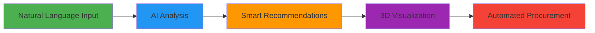
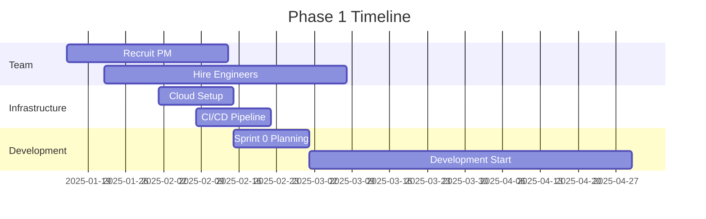

<div align="center">

# 🚀 OFS AI Transformation Project

### *Revolutionizing Commercial Furniture with Artificial Intelligence*

[](https://github.com/SquizAI/ofs)
[](https://github.com/SquizAI/ofs)
[](https://github.com/SquizAI/ofs)
[](https://github.com/SquizAI/ofs)
[](https://github.com/SquizAI/ofs)

---

### **Transforming a 60-year-old furniture manufacturer into an AI-first technology company**

</div>

---

## 📊 **Executive Dashboard**

<table>
<tr>
<td align="center" width="25%">

<h3>$56M+</h3>
<p><strong>Year 1 Return</strong></p>
</td>
<td align="center" width="25%">

<h3>82%</h3>
<p><strong>Time Reduction</strong></p>
</td>
<td align="center" width="25%">

<h3>Multi-Agent</h3>
<p><strong>AI Architecture</strong></p>
</td>
<td align="center" width="25%">

<h3>20x</h3>
<p><strong>User Growth</strong></p>
</td>
</tr>
</table>

---

## 🎯 **The Vision**

> **Transform OFS from a furniture manufacturer with digital tools into a technology-enabled solutions provider using artificial intelligence to create optimal workspace environments.**

### **The Opportunity**

We're not just building a tool—we're creating a **platform that learns, recommends, and optimizes** every aspect of commercial furniture specification, from initial conversation to final installation.

<div align="center">



</div>

---

## 💰 **Business Impact at a Glance**

<table>
<tr>
<th>Category</th>
<th>Current State</th>
<th>With AI Platform</th>
<th>Impact</th>
</tr>
<tr>
<td><strong>⏱️ Estimate Time</strong></td>
<td>45 minutes</td>
<td>8 minutes</td>
<td><span style="color: green"><strong>82% faster</strong></span></td>
</tr>
<tr>
<td><strong>📈 Win Rate</strong></td>
<td>36%</td>
<td>45%</td>
<td><span style="color: green"><strong>+$13.5M/year</strong></span></td>
</tr>
<tr>
<td><strong>👥 Users</strong></td>
<td>500 (gated)</td>
<td>10,000+ (self-service)</td>
<td><span style="color: green"><strong>20x growth</strong></span></td>
</tr>
<tr>
<td><strong>💵 Deal Size</strong></td>
<td>Baseline</td>
<td>+15% larger</td>
<td><span style="color: green"><strong>+$10M/year</strong></span></td>
</tr>
<tr>
<td><strong>⚠️ Errors</strong></td>
<td>8% change order rate</td>
<td>2% change order rate</td>
<td><span style="color: green"><strong>$300K saved</strong></span></td>
</tr>
</table>

---

## 🏗️ **What We're Building**

### **🤖 AI-Powered Capabilities**

<details open>
<summary><strong>🗣️ Conversational Interface</strong></summary>

> "I need 50 workstations for an open office, budget around $200K, needs to be ADA compliant"

The AI understands natural language and extracts:
- Quantity: 50 workstations
- Space type: Open office
- Budget: $200K
- Requirements: ADA compliance
- Generates complete estimate in minutes
</details>

<details open>
<summary><strong>🏢 Floor Plan Intelligence</strong></summary>

- **Upload** PDF, image, or CAD files
- **Analyze** with computer vision (trained on 10,000+ plans)
- **Extract** dimensions, zones, circulation paths
- **Suggest** optimal furniture layouts
- **Validate** code compliance automatically
</details>

<details open>
<summary><strong>💡 Smart Recommendations</strong></summary>

Machine learning models that:
- Analyze 60 years of OFS project data
- Learn from successful installations
- Suggest products based on space type, industry, budget
- Recommend complementary items (desk → storage → lighting)
- Improve with every project
</details>

<details open>
<summary><strong>📊 Multi-Scenario Budgeting</strong></summary>

Generate 3 scenarios in 10 seconds:
- **💰 Economy:** Value-focused options
- **⭐ Standard:** Balanced quality and cost
- **👑 Premium:** High-end specifications

Each with detailed line items, pricing, and visualizations
</details>

<details open>
<summary><strong>🎨 Advanced Visualization</strong></summary>

- **3D Rendering:** Photorealistic images in seconds
- **AR Mode:** View furniture in actual space via phone
- **VR Experience:** Walk through space in Quest/Vision Pro
- **Real-Time Editing:** Drag-and-drop furniture placement
</details>

<details open>
<summary><strong>✅ Compliance Validation</strong></summary>

Automated checking for:
- ♿ ADA accessibility requirements
- 🔥 Fire code egress paths
- 🏢 IBC building codes
- 🌱 LEED certification criteria
- ⚡ Electrical requirements
</details>

<details open>
<summary><strong>🌍 Sustainability Tracking</strong></summary>

Real-time calculation of:
- Carbon footprint per product
- Recycled material percentages
- BIFMA certifications
- WELL Building Standard compliance
- Carbon offset options
</details>

<details open>
<summary><strong>🔄 End-to-End Orchestration</strong></summary>

- Automated quote generation
- CRM integration (Salesforce)
- Order management
- Manufacturing coordination
- Logistics tracking
- Installation scheduling
</details>

---

## 🎯 **Technology Stack**

<div align="center">

### **Frontend**


### **Backend**


### **AI/ML**


### **Infrastructure**


</div>

---

## 📁 **Documentation Structure**

<div align="center">

```
🌳 OFS_AI_Transformation_Project/
│
├── 📋 01_Executive_Summary/
│   └── Executive_Summary.md              # 15-min read for leadership
│
├── 📄 02_Product_Requirements/
│   └── PRD_OFS_AI_Enhanced_Platform.md   # 45-min read for PMs
│
├── ⚙️ 03_Technical_Architecture/
│   └── Architecture_Overview.md           # 60-min read for engineers
│
├── 🤖 04_AI_Capabilities_Analysis/
│   └── AI_Transformation_Deep_Dive.md    # 90-min read for ML teams
│
├── 🗓️ 05_Implementation_Roadmap/
│   └── Detailed timeline, milestones      # Coming soon
│
├── 💼 06_Business_Case/
│   └── Financial models, ROI analysis     # Coming soon
│
├── 🏆 07_Competitive_Analysis/
│   └── Market positioning                 # Coming soon
│
├── 👥 08_User_Research/
│   └── Personas, journeys, pain points    # Coming soon
│
├── 📚 09_Supporting_Documents/
│   └── Research, mockups                  # Coming soon
│
└── 📖 10_Appendices/
    └── Glossary, acronyms, resources      # Coming soon
```

</div>

---

## 🚀 **Quick Start Guide**

<table>
<tr>
<td width="50%">

### **👔 For Executives**

**📖 Start here:** [Executive Summary](./OFS_AI_Transformation_Project/01_Executive_Summary/Executive_Summary.md)

**What you'll learn:**
- 💰 Business case and ROI projections
- 🎯 High-level solution overview
- 💵 Investment requirements
- ⚠️ Risk assessment
- ✅ Recommendation

**⏱️ Reading time:** 15 minutes

</td>
<td width="50%">

### **📊 For Product Managers**

**📖 Start here:** [Product Requirements](./OFS_AI_Transformation_Project/02_Product_Requirements/PRD_OFS_AI_Enhanced_Platform.md)

**What you'll learn:**
- ✨ Feature specifications
- 👥 User personas and use cases
- 📈 Success metrics
- 🗓️ Implementation phases
- ✅ Acceptance criteria

**⏱️ Reading time:** 45 minutes

</td>
</tr>
<tr>
<td width="50%">

### **⚙️ For Engineers & Architects**

**📖 Start here:** [Technical Architecture](./OFS_AI_Transformation_Project/03_Technical_Architecture/Architecture_Overview.md)

**What you'll learn:**
- 🏗️ System architecture diagrams
- 💻 Technology stack details
- 🗄️ Database schemas
- 🔌 API specifications
- 🔒 Security considerations

**⏱️ Reading time:** 60 minutes

</td>
<td width="50%">

### **🤖 For AI/ML Teams**

**📖 Start here:** [AI Capabilities](./OFS_AI_Transformation_Project/04_AI_Capabilities_Analysis/AI_Transformation_Deep_Dive.md)

**What you'll learn:**
- 🧠 Multi-agent architecture
- 📊 ML model specifications
- 🎯 Training data requirements
- ⚖️ AI ethics and governance
- 🔬 Evaluation metrics

**⏱️ Reading time:** 90 minutes

</td>
</tr>
</table>

---

## 📈 **Implementation Roadmap**

<div align="center">

### **🎯 Phase 1: MVP Foundation** (Months 1-4)

**💰 Investment:** $1.2M | **📊 Return:** $3M/year | **⏱️ Payback:** 5 months

</div>

<table>
<tr>
<th width="50%">Deliverables</th>
<th width="50%">Success Metrics</th>
</tr>
<tr>
<td>

- ✅ Conversational intake interface
- ✅ Floor plan parsing (PDF, images, CAD)
- ✅ Budget scenario generation
- ✅ Basic 3D visualization
- ✅ Product catalog integration

</td>
<td>

- 👥 **500** Monthly Active Users
- 📋 **5,000** Estimates Created
- ⏱️ **<10 min** Average Time
- ⭐ **60+** Net Promoter Score

</td>
</tr>
</table>

---

<div align="center">

### **🧠 Phase 2: Intelligence Layer** (Months 5-8)

**💰 Investment:** $1.5M | **📊 Return:** $15M/year | **⏱️ Payback:** 7 months

</div>

<table>
<tr>
<th width="50%">Deliverables</th>
<th width="50%">Success Metrics</th>
</tr>
<tr>
<td>

- ✅ AI recommendations (ML-powered)
- ✅ Voice input support
- ✅ Compliance checking (ADA, IBC, NFPA)
- ✅ Multi-user collaboration
- ✅ Sustainability tracking
- ✅ Mobile app (iOS, Android)

</td>
<td>

- 👥 **2,500** Monthly Active Users
- 🤖 **65%** AI Recommendation Acceptance
- 📊 **4+** Scenarios per Project
- ⭐ **70+** Net Promoter Score

</td>
</tr>
</table>

---

<div align="center">

### **🌐 Phase 3: Ecosystem Platform** (Months 9-12)

**💰 Investment:** $1.8M | **📊 Return:** $50M/year | **⏱️ Payback:** 12 months

</div>

<table>
<tr>
<th width="50%">Deliverables</th>
<th width="50%">Success Metrics</th>
</tr>
<tr>
<td>

- ✅ Public API + developer portal
- ✅ Revit + SketchUp plugins
- ✅ Salesforce connector
- ✅ AR visualization (mobile)
- ✅ VR experience (Quest, Vision Pro)
- ✅ Procurement automation
- ✅ Predictive analytics

</td>
<td>

- 👥 **10,000** Monthly Active Users
- 🔌 **50+** Third-Party Integrations
- 💰 **$50M** Revenue Attribution
- ⭐ **75+** Net Promoter Score

</td>
</tr>
</table>

---

## 💎 **ROI & Financial Projections**

<div align="center">

### **Year 1 Investment & Returns**

</div>

| Phase | Investment | Timeline | Expected Return | Payback Period |
|:------|:-----------|:---------|:----------------|:---------------|
| 🎯 **Phase 1** | $1.2M | Months 1-4 | $3M/year | **5 months** |
| 🧠 **Phase 2** | $1.5M | Months 5-8 | $15M/year | **7 months** |
| 🌐 **Phase 3** | $1.8M | Months 9-12 | $50M/year | **12 months** |
| 💰 **TOTAL** | **$4.5M** | **12 months** | **$56M/year** | **10 months** |

<div align="center">

### **5-Year Projection: $376M Total Return**

</div>

<table>
<tr>
<th>Year</th>
<th>Investment</th>
<th>Gross Return</th>
<th>Net Benefit</th>
<th>Cumulative ROI</th>
</tr>
<tr>
<td align="center">1</td>
<td align="center">$4.5M</td>
<td align="center">$32.5M</td>
<td align="center">$28M</td>
<td align="center"><strong style="color: green">527%</strong></td>
</tr>
<tr>
<td align="center">2</td>
<td align="center">$3M</td>
<td align="center">$57M</td>
<td align="center">$54M</td>
<td align="center"><strong style="color: green">1,617%</strong></td>
</tr>
<tr>
<td align="center">3</td>
<td align="center">$2M</td>
<td align="center">$79M</td>
<td align="center">$77M</td>
<td align="center"><strong style="color: green">2,973%</strong></td>
</tr>
<tr>
<td align="center">4</td>
<td align="center">$1.5M</td>
<td align="center">$99.5M</td>
<td align="center">$98M</td>
<td align="center"><strong style="color: green">4,573%</strong></td>
</tr>
<tr>
<td align="center">5</td>
<td align="center">$1M</td>
<td align="center">$120M</td>
<td align="center">$119M</td>
<td align="center"><strong style="color: green">6,500%</strong></td>
</tr>
<tr style="background-color: #f0f0f0; font-weight: bold;">
<td align="center">TOTAL</td>
<td align="center">$12M</td>
<td align="center">$388M</td>
<td align="center">$376M</td>
<td align="center"><strong style="color: green">3,033%</strong></td>
</tr>
</table>

---

## 🏆 **Competitive Advantage**

<table>
<tr>
<th width="25%">Advantage</th>
<th width="25%">Strength</th>
<th width="50%">Description</th>
</tr>
<tr>
<td>🗄️ <strong>Data Moat</strong></td>
<td><span style="color: green"><strong>STRONG</strong></span></td>
<td>
60 years of exclusive OFS project data<br>
Manufacturing cost visibility<br>
Win/loss intelligence
</td>
</tr>
<tr>
<td>🚀 <strong>Technology Lead</strong></td>
<td><span style="color: orange"><strong>MODERATE</strong></span></td>
<td>
12-18 month lead with multi-agent AI<br>
Proprietary ML models<br>
Patent applications filed
</td>
</tr>
<tr>
<td>🌐 <strong>Network Effects</strong></td>
<td><span style="color: blue"><strong>GROWING</strong></span></td>
<td>
More projects → better AI → more users<br>
Third-party integrations create lock-in<br>
Dealer ecosystem reinforcement
</td>
</tr>
<tr>
<td>🎨 <strong>Brand Position</strong></td>
<td><span style="color: green"><strong>UNIQUE</strong></span></td>
<td>
Family-owned, American-made<br>
Sustainability leadership<br>
"AI-First Furniture Company"
</td>
</tr>
</table>

---

## ⚠️ **Risk Assessment & Mitigation**

<details>
<summary><strong>🔴 Technical Risks</strong></summary>

| Risk | Probability | Impact | Mitigation Strategy |
|:-----|:-----------|:-------|:-------------------|
| AI hallucination | 🟡 Medium | 🔴 High | Validation rules, confidence thresholds, human-in-loop for >$100K |
| Floor plan parsing <80% | 🟡 Medium | 🟡 Medium | Manual review UI, diverse training data, native CAD support |
| Scalability bottlenecks | 🟡 Medium | 🔴 High | Load testing at 10x, auto-scaling, graceful degradation |

</details>

<details>
<summary><strong>🟠 Business Risks</strong></summary>

| Risk | Probability | Impact | Mitigation Strategy |
|:-----|:-----------|:-------|:-------------------|
| Low user adoption | 🟡 Medium | 🔴 High | Extensive beta testing, training programs, maintain legacy tool |
| Data quality issues | 🟡 Medium | 🔴 High | Pre-launch audit, automated validation, feedback loop |
| Competitive response | 🔴 High | 🟡 Medium | Rapid iteration, data moat focus, patent protection |

</details>

<details>
<summary><strong>🟣 Regulatory Risks</strong></summary>

| Risk | Probability | Impact | Mitigation Strategy |
|:-----|:-----------|:-------|:-------------------|
| Data privacy violations | 🟢 Low | 🔴 High | Privacy by design, legal review, DPO oversight |
| AI bias/discrimination | 🟡 Medium | 🔴 High | Fairness metrics, diverse training data, ethics board |

</details>

---

## 👥 **Team Structure**

<div align="center">

### **Phase 1 Core Team (12 FTE)**

</div>

<table>
<tr>
<td align="center" width="33%">
<h4>🎯 Product</h4>
<p>1 Product Manager<br>1 Product Designer</p>
</td>
<td align="center" width="33%">
<h4>💻 Engineering</h4>
<p>3 Frontend Engineers<br>3 Backend Engineers<br>2 ML Engineers<br>1 DevOps Engineer</p>
</td>
<td align="center" width="33%">
<h4>✅ Quality</h4>
<p>1 QA Engineer</p>
</td>
</tr>
</table>

<div align="center">

**Annual Run Rate:** ~$1.8M

---

### **Expanded Team (Phase 2-3): 17 FTE**

**Additions:** +1 Mobile Engineer | +1 ML Engineer | +2 Integration Engineers | +1 VR Developer | +1 Data Analyst

**Annual Run Rate:** ~$2.8M

</div>

---

## 📞 **Contact & Governance**

### **Steering Committee**

| Role | Responsibility |
|:-----|:--------------|
| 👔 **CEO** | Strategic alignment |
| 💰 **CFO** | Financial oversight |
| 💻 **CTO** | Technical feasibility |
| 📊 **VP Product** | Prioritization |
| 📈 **VP Sales** | Market feedback |
| 🏭 **VP Manufacturing** | Operations integration |

### **Communication Channels**

- **💬 Slack:** `#ai-transformation-project`
- **📧 Email:** ai-project@ofs.com
- **📅 Meetings:**
  - Weekly: Team standup (Fridays 2pm ET)
  - Bi-weekly: Steering committee (Tuesdays 10am ET)
  - Monthly: Executive review (First Monday 9am ET)

---

## ⏭️ **Next Steps**

<div align="center">

### **🎯 Immediate Actions (Week 1-2)**

</div>

<table>
<tr>
<td width="33%">

#### **1️⃣ Executive Review**
- Present to leadership
- Gather feedback
- Schedule decision meeting

</td>
<td width="33%">

#### **2️⃣ Stakeholder Alignment**
- Sales team validation
- Manufacturing feasibility
- IT/Security readiness

</td>
<td width="33%">

#### **3️⃣ Budget Approval**
- CFO financial review
- FY budget allocation
- Project funding setup

</td>
</tr>
</table>

<div align="center">

### **🚀 Phase 1 Kickoff (Week 3-12)**

</div>



---

## ✅ **Success Criteria**

### **Launch Readiness Checklist**

- [ ] 📊 95%+ uptime in staging (2 weeks)
- [ ] ⚠️ <0.5% error rate on core flows
- [ ] 🔒 Security audit passed
- [ ] ⚡ Performance benchmarks met (200ms API, 1.5s page load)
- [ ] 👥 50+ positive beta testers
- [ ] ✅ Executive sign-off
- [ ] 🔄 Rollback plan tested
- [ ] 📚 Customer support training completed
- [ ] 📢 Marketing materials prepared
- [ ] 👔 Sales team onboarded

---

## 📚 **Additional Resources**

### **🔗 Internal Links**

- **🏠 OFS Website:** https://ofs.com
- **⚡ Fast Furniture Estimator:** https://ofs.com/fast-furniture-estimator
- **🔐 Dealer Portal (MyOFS):** https://myofs.com
- **🛒 Online Store:** https://store.ofs.com

### **📊 External Research**

- 📈 Gartner: Future of AI in B2B Sales Tools (2024)
- 💼 McKinsey: The State of AI (2024)
- 🏆 Forrester Wave: Contract Furniture Digital Tools (2024)

### **👁️ Competitive Intelligence**

- 🏢 Herman Miller: https://www.hermanmiller.com
- 💺 Steelcase: https://www.steelcase.com
- 🪑 Haworth: https://www.haworth.com

---

## 📖 **Glossary & Acronyms**

<details>
<summary><strong>Click to expand key terms</strong></summary>

### **Key Terms**

- **ADA:** Americans with Disabilities Act
- **API:** Application Programming Interface
- **AR:** Augmented Reality
- **CAD:** Computer-Aided Design
- **ERP:** Enterprise Resource Planning
- **FF&E:** Furniture, Fixtures & Equipment
- **IBC:** International Building Code
- **LLM:** Large Language Model
- **MAU:** Monthly Active Users
- **NPS:** Net Promoter Score
- **PRD:** Product Requirements Document
- **ROI:** Return on Investment
- **VR:** Virtual Reality

</details>

---

## ⚖️ **License & Confidentiality**

<div align="center">

**© 2025 OFS Brands. All Rights Reserved.**

This document and all associated materials are confidential and proprietary to OFS Brands.

**Classification:** Internal - Strategic Planning
**Distribution:** Executive Leadership, Project Team
**Retention:** 7 years from project completion

</div>

---

## 🌟 **Why This Matters**

<div align="center">

### **This isn't just a software project—it's a transformation.**

We're leveraging **60 years of OFS expertise** combined with **cutting-edge AI** to fundamentally change how commercial furniture is specified, sold, and delivered.

The question isn't whether AI will transform our industry.
**The question is whether OFS will lead that transformation or follow it.**

---

### **🚀 Let's build the future of commercial furniture together.**

---

[](https://github.com/SquizAI/ofs)
[](https://github.com/SquizAI/ofs)

**Last Updated:** October 14, 2025 | **Version:** 1.0 | **Next Review:** November 1, 2025

</div>

---

<div align="center">

**Questions or Feedback?**

📧 ai-project@ofs.com | 💬 #ai-transformation-project | 📱 Contact Project Sponsor

</div>
